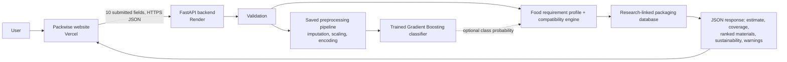

# Packwise

PACKWISE is a browser-based decision-support prototype for SIH 2026 Problem Statement 26236: **AI-Based Intelligent Food Packaging Material Recommendation System for Food Commodities**.

It preserves the existing Packwise visual design and connects the website to a frontend → API → preprocessing pipeline → trained classifier plus property-based material compatibility engine. The classifier returns a packaging-material class. It does not predict food safety or shelf life.

## Evidence status

The research search found public resources on food composition, produce respiration, packaging composition/permeability, MAP design and packaging/shelf-life studies. It did **not** find a verified experimental dataset that labels the requested joint input (food properties + storage/transport conditions) with an experimentally selected packaging material. The public datasets found measure different things; they are catalogued, with row/schema/license limitations, in [`docs/research_sources.json`](docs/research_sources.json).

The prototype therefore uses a **research-derived synthetic/curated dataset** with 331 deterministic scenario rows across seven food profiles. It is not experimentally collected data. A versioned generator and label policy are in [`ml/training/generate_dataset.py`](ml/training/generate_dataset.py); the reproducible CSV is [`datasets/processed/packwise_research_curated_v1.csv`](datasets/processed/packwise_research_curated_v1.csv). Every row comes from an explicit condition grid and a documented label rule. There are no random rows or unrelated datasets. The rules express prototype curation assumptions informed by literature; their cutoffs have not been validated in packaging trials.

Five USDA FoodData Central records supply selected illustrative moisture/fat centers, including raw bananas (FDC 173944). UC Davis postharvest fact sheets supply tomato and banana respiration context. FAO banana-packing guidance supports the prototype class “ventilated fiberboard banana carton with PE liner.” This is a research-derived curated class, not an experimentally selected optimum or a measured package trial. Example pH centers and biscuit/frozen-vegetable composition centers are explicitly marked as demo values. **pH is stored and validated but not used by the classifier:** the reviewed sources did not support a pH-to-material-class threshold, and fixed pH anchors could leak commodity identity.

## Architecture



The trained classifier returns a material class and, when available, its raw probability as `confidence`. Separately, the compatibility engine builds food requirements from submitted properties, scores each material from its qualitative capability bands, and ranks the catalog. Missing factors are excluded from the suitability average and lower its separate data-coverage value. Valid custom foods follow the same ranking path. The material bands are estimates, not measured OTR, WVTR, sealability, strength or shelf-life results.

## Repository structure

```text
frontend/                   Existing Packwise UI, updated for live API calls; Vite/Vercel website
  src/app.js                UI, actual form submission, API response rendering
  src/api.js                VITE_API_URL client and error handling
  src/data/scenarios.js     Seven explicit demo inputs (editable before submission)
  src/styles.css            Preserved and refined Packwise design system
backend/                    FastAPI application and deployment dependencies
  packwise_api.py           POST /api/recommend, GET /api/health, catalog/model-card APIs
ml/training/                Deterministic data generator and model comparison/training
ml/models/                  Trained pipeline, preprocessing pipeline and metadata
datasets/raw/               Dataset search notes; no unrelated data copied
datasets/processed/         Reproducible 331-row curated dataset + metadata
datasets/reference/         Pinned FoodOn food-product vocabulary for offline name validation
packaging_database/         Sourced qualitative profiles; no unsupported spec values
docs/                       Source registry, architecture, methodology, evaluation, deployment, judge answers
tests/                      Backend/data and integration regression tests
render.yaml                 Render API blueprint
.gitignore                  Secrets, virtualenv, dependencies and build output
```

## Model, data and evaluation

- **Dataset:** 331 research-derived synthetic/curated rows, seven commodity profiles, nine target classes.
- **Dataset features:** commodity, moisture content, fat/oil content, pH, respiration rate, shelf-life target, storage temperature, humidity, storage condition and transport condition.
- **Model features:** eight measured/storage fields: moisture, fat/oil, respiration rate, shelf-life target, temperature, humidity, storage condition and transport condition. Commodity name and pH are validated/echoed but excluded from the classifier.
- **Target:** `recommended_packaging_material`.
- **Models compared:** Logistic Regression, Random Forest and Gradient Boosting.
- **Selected model:** Gradient Boosting for the current artifact, selected by four-fold stratified CV macro-F1 (accuracy breaks ties). Final pipeline and a separate copy of its fitted preprocessing stage were saved with joblib.
- **Actual synthetic-grid metrics:** see [`docs/model_report.md`](docs/model_report.md) and the generated model card. These are not real-food predictive accuracy.
- **Imbalance/leakage controls:** macro metrics and per-class counts are reported; preprocessing is inside the scikit-learn Pipeline and fits per training fold; the split/helper column is excluded; duplicate, missing-value, composition and range checks run before training. The held-out partition is separate from model selection.

The high internal metrics mean the fitted estimator reproduces labels created from the same curated design policy. They do not establish that the labels are correct or that the model generalizes to real packages. The model report includes fold variation and confusion matrix.

## Local setup (PowerShell)

Prerequisites: Python 3.11+ (tested here with 3.13), Node.js 20+, and npm.

```powershell
Set-Location 'D:\Packwise Project'
python -m venv .venv
.\.venv\Scripts\python.exe -m pip install -r backend\requirements-dev.txt
.\.venv\Scripts\python.exe ml\training\generate_dataset.py
.\.venv\Scripts\python.exe ml\training\train_model.py
```

Terminal 1, backend:

```powershell
Set-Location 'D:\Packwise Project'
.\.venv\Scripts\python.exe -m uvicorn backend.packwise_api:app --reload --host 127.0.0.1 --port 8000
```

Terminal 2, website:

```powershell
Set-Location 'D:\Packwise Project\frontend'
npm install
npm run dev
```

Open `http://127.0.0.1:5173`. The frontend defaults to `http://127.0.0.1:8000`. For another backend, set `VITE_API_URL` in `frontend/.env.local` (copy `frontend/.env.example`); Vite reads it at build/start time. The API allows the two local Vite origins by default.

## API contract

`POST /api/recommend` accepts JSON with exactly these required fields:

```json
{
  "commodity": "tomatoes",
  "moisture": 94.5,
  "fat": 0.2,
  "ph": 4.3,
  "respiration_rate": 7.5,
  "shelf_life": 7,
  "temperature": 10,
  "humidity": 90,
  "storage_condition": "ambient",
  "transport_condition": "local"
}
```

The seven named training profiles are `tomatoes`, `potato_chips`, `biscuits`, `pasteurized_milk`, `frozen_vegetables`, `lentils`, and `bananas` (display-name aliases such as “banana” are accepted). The API also checks unseen names against the bundled FoodOn food-product vocabulary (12,655 terms in the pinned snapshot). A recognized unseen food such as `Dragon Fruit` is accepted and sent through the same property-only preprocessing and classifier; the name is not a model feature. Nonsense names such as `jjjgjghghg` and `abcxyz123` return HTTP 422 before inference. The API reports unseen status and compares measured values with global training ranges; values beyond those spans receive an extrapolation warning. This marginal range check does not detect every unusual combination of otherwise in-range features.

For mature-green bananas, the curated model class is a ventilated fiberboard carton with a PE liner, based on the sources documented in the source registry. Use the form's measured food and storage inputs; the preview starts at 13.5 °C, 90% RH, and 20 mL CO₂/kg·h as illustrative values. The result remains a prototype candidate that needs a specified carton/liner and package testing. A successful response includes `recommended_material`, the raw predicted-class probability as `confidence` when the estimator provides it, `suitability`, `target_shelf_life_days`, `packaging_properties`, `important_features`, `explanation`, `alternatives`, warnings, input echo and model identity.

Other endpoints:

- `GET /api/health` — deployment/model readiness (`503` if model artifacts are missing).
- `GET /api/materials` — qualitative packaging profiles with research links.
- `GET /api/model-card` — actual training metadata, class counts, CV/holdout metrics and confusion matrix.

Out-of-range values, unrecognized food names, impossible content sums and conflicting storage/temperature pairs return HTTP 422. Optional food and storage measurements may be left blank; they are sent as `null` and omitted from the suitability average. The backend validates names independently of the browser. Known FoodOn names and unseen names containing a recognized food term use `prediction_scope: valid_unseen_commodity` and follow the same property-based ranking. The response includes an estimated suitability score, data coverage, ranked alternatives and an estimated sustainability index. Sustainability is a limited design proxy, not a life-cycle assessment; package mass, regional recycling outcomes and measured food-loss reduction remain unavailable. Model inference failures fall back to the compatibility engine when the material database is loaded. CORS is configured from `PACKWISE_ALLOWED_ORIGINS`.

## Retraining

```powershell
Set-Location 'D:\Packwise Project'
.\.venv\Scripts\python.exe ml\training\generate_dataset.py
.\.venv\Scripts\python.exe ml\training\train_model.py
```

Review the new dataset metadata and [`docs/model_report.md`](docs/model_report.md) before using or presenting a retrained model. The CSV and `.joblib` outputs are intentionally kept in the project for reproducibility.

## Tests and local verification

```powershell
Set-Location 'D:\Packwise Project'
.\.venv\Scripts\python.exe -m pytest tests -q
Set-Location frontend
npm run build
```

The API tests cover Apple, Banana and unseen Dragon Fruit inputs, invalid names rejected before inference, numerical bounds, support-range warnings, model artifact failures, CORS, and packaging catalog integrity. The build command checks the Vite production bundle. See [`docs/model_report.md`](docs/model_report.md) for model evaluation.

## Deployment

The website and API are deployed and connected to the private GitHub repository [`Shiladittya01/packwise-sih-26236`](https://github.com/Shiladittya01/packwise-sih-26236) on `main`.

- Website: https://packwise-sih-26236.vercel.app
- API: https://packwise-api-26236.onrender.com
- Health check: https://packwise-api-26236.onrender.com/api/health
- Vercel project root: `frontend`; `VITE_API_URL` points to the Render API.
- Render runs the Python API from the repository root and allows the exact Vercel production origin through `PACKWISE_ALLOWED_ORIGINS`.

Production flow: browser → Vercel website → HTTPS Render API → validation → optional saved classifier prediction plus property-based compatibility ranking → ranked material profiles, estimated suitability, coverage, sustainability proxy and warnings. Vercel builds the frontend and Render builds the API from the existing GitHub `main` branch. Each release must be checked against both live endpoints; the current deployment record and checks are in [`docs/deployment.md`](docs/deployment.md).

## Limitations and future work

- Labels are curation rules, not independent measured decisions; internal metrics only measure rule-grid reproduction.
- Dataset scope is seven archetypes and 331 constructed scenarios. Banana support is limited to a mature-green Cavendish-inspired profile; it does not represent all cultivars, ripeness stages, recipes, mass, package area, suppliers, regions or processes.
- The model predicts a class, not an optimal package design, shelf life, safety outcome, migration result or regulatory compliance.
- Packaging profile entries do not invent exact values. Obtain supplier data and test the actual converted pack at relevant temperature/humidity and with the intended fill.
- A field-level global importance plot is not causal and is not an explanation for a particular prediction.
- Production use requires real trial data, independent validation, expert review, food-contact compliance checks, package integrity testing, and cold-chain/microbial/shelf-life validation.

## SIH judge answers

1. **Where exactly is the AI?** In `ml/models/packwise_pipeline.joblib`, a fitted scikit-learn classifier pipeline loaded by `backend/packwise_api.py`. The current selected estimator is Gradient Boosting. A browser request is validated, preprocessed and passed to `predict()`. The separate suitability check is explicitly rule-based.
2. **Where did the dataset come from?** There is no public experimental dataset for this full target in the sources inspected. The 331-row prototype data is generated by `ml/training/generate_dataset.py` from documented research relationships and explicit prototype curation rules. Public source candidates and their scope, license, fields and limitations are recorded in `docs/research_sources.json`.
3. **If you created it, how?** A deterministic condition grid spans seven commodity archetypes. Banana respiration and storage anchors come from UC Davis; its curated carton/liner target follows the banana packing format described by FAO. The other labels follow their documented food/material curation rules. No random values are used. These are prototype labels, not experimental package decisions.
4. **How many samples?** 331 constructed rows. They are scenarios, not 331 independent laboratory tests.
5. **Why this model?** The trainer compares Logistic Regression, Random Forest and Gradient Boosting by four-fold CV macro-F1, with CV accuracy as a tie-breaker. Gradient Boosting is selected for the current artifact (see the report), not based on a single holdout accuracy.
6. **What are the evaluation metrics?** The report lists accuracy, macro precision, macro recall, macro-F1, fold standard deviations, a separate holdout set and a nine-class confusion matrix. They measure reproduction of synthetic labels only.
7. **How do you prevent overfitting?** Preprocessing is fitted inside each CV fold; duplicate and validation checks run; the split helper is excluded from features; a separate holdout is reported; class imbalance is surfaced with macro metrics. This cannot remove the limitation that all labels come from the same constructed rule policy.
8. **How does the recommendation change?** Inputs are serialized from the form and sent to `/api/recommend`; tomato and snack examples can cross learned class boundaries as conditions change. The classifier uses eight measured/storage fields and excludes commodity name and pH. A valid unseen food is checked against the bundled FoodOn vocabulary and passes through the same property-only pipeline. Its response is marked `valid_unseen_commodity`; it still requires expert review because labels are synthetic and there is no commodity-specific application mapping.
9. **How is it different from a simple rule engine?** Runtime inference is a trained estimator with a fitted preprocessing pipeline and learned class boundaries; the label-generating policy is not run by the API. Because training labels are themselves curated rules, the prototype does not claim a scientific advantage over those rules. It demonstrates an end-to-end supervised ML pipeline that must be replaced/validated with real labels.
10. **Can it be used in real food packaging?** Not as an operational selection or specification. It is a prototype shortlist and requires expert, supplier, food-contact and package-performance validation.
11. **Limitations?** Synthetic labels, small archetype scope, no independent trial data, no calibrated probabilities, no exact supplier specifications, and no shelf-life/safety prediction.
12. **Future improvements?** Collect package trial data with the food, film structure, thickness, OTR/WVTR test conditions, seal/integrity outcomes and storage/transport history; have packaging scientists define labels; validate on held-out commodities and suppliers; add calibrated uncertainty only after a representative independent dataset exists.
