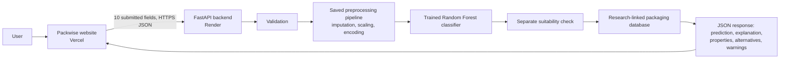

# Packwise

PACKWISE is a browser-based decision-support prototype for SIH 2026 Problem Statement 26236: **AI-Based Intelligent Food Packaging Material Recommendation System for Food Commodities**.

It preserves the existing Packwise visual design and replaces its browser-only weighted rules engine with a real frontend → API → preprocessing pipeline → trained scikit-learn classifier → separate suitability check → source-linked packaging database flow. The classifier returns a packaging-material class. It does not predict food safety or shelf life.

## Evidence status

The research search found public resources on food composition, produce respiration, packaging composition/permeability, MAP design and packaging/shelf-life studies. It did **not** find a verified experimental dataset that labels the requested joint input (food properties + storage/transport conditions) with an experimentally selected packaging material. The public datasets found measure different things; they are catalogued, with row/schema/license limitations, in [`docs/research_sources.json`](docs/research_sources.json).

The prototype therefore uses a **research-derived synthetic/curated dataset** with 295 deterministic scenario rows. It is not experimentally collected data. A versioned generator and label policy are in [`ml/training/generate_dataset.py`](ml/training/generate_dataset.py); the reproducible CSV is [`datasets/processed/packwise_research_curated_v1.csv`](datasets/processed/packwise_research_curated_v1.csv). Every row comes from an explicit condition grid and a documented label rule. There are no random rows or unrelated datasets. The rules express prototype curation assumptions informed by literature; their cutoffs have not been validated in packaging trials.

The four USDA FoodData Central records used as illustrative composition anchors are cited in the source registry. UC Davis tomato respiration ranges inform two tomato anchors. Example pH centers and biscuit/frozen-vegetable composition centers are explicitly marked as demo values. **pH is stored and validated but not used by the classifier:** the reviewed sources did not support a pH-to-material-class threshold, and fixed pH anchors could leak commodity identity.

## Architecture



The runtime recommendation is a model prediction; the dataset’s curation rules are only used to generate training labels. Post-prediction suitability is a separate check against the database application list. The API returns `confidence: null`; no percentage is shown because there is no experimental calibration set. Material properties such as thickness, OTR, WVTR, sealability and mechanical strength stay qualitative or blank unless an exact structure and test conditions are sourced.

## Repository structure

```text
frontend/                   Existing Packwise UI, updated for live API calls; Vite/Vercel website
  src/app.js                UI, actual form submission, API response rendering
  src/api.js                VITE_API_URL client and error handling
  src/data/scenarios.js     Six explicit demo inputs (editable before submission)
  src/styles.css            Preserved and refined Packwise design system
backend/                    FastAPI application and deployment dependencies
  packwise_api.py           POST /api/recommend, GET /api/health, catalog/model-card APIs
ml/training/                Deterministic data generator and model comparison/training
ml/models/                  Trained pipeline, preprocessing pipeline and metadata
datasets/raw/               Dataset search notes; no unrelated data copied
datasets/processed/         Reproducible 295-row curated dataset + metadata
packaging_database/         Sourced qualitative profiles; no unsupported spec values
docs/                       Source registry, architecture, methodology, evaluation, deployment, judge answers
tests/                      Backend/data and integration regression tests
render.yaml                 Render API blueprint
.gitignore                  Secrets, virtualenv, dependencies and build output
```

## Model, data and evaluation

- **Dataset:** 295 research-derived synthetic/curated rows, six commodity profiles, eight target classes.
- **Dataset features:** commodity, moisture content, fat/oil content, pH, respiration rate, shelf-life target, storage temperature, humidity, storage condition and transport condition.
- **Model features:** nine of those fields. pH is accepted, validated and echoed but excluded from the model for the reason above.
- **Target:** `recommended_packaging_material`.
- **Models compared:** Logistic Regression, Random Forest and Gradient Boosting.
- **Selected model:** Random Forest, selected by four-fold stratified CV macro-F1 (accuracy breaks ties). Final model and preprocessing were saved with joblib.
- **Actual synthetic-grid metrics:** see [`docs/model_report.md`](docs/model_report.md) and the generated model card. These are not real-food predictive accuracy.
- **Imbalance/leakage controls:** macro metrics and per-class counts are reported; preprocessing is inside the scikit-learn Pipeline and fits per training fold; the split/helper column is excluded; duplicate, missing-value, composition and range checks run before training. The held-out partition is separate from model selection.

The high internal metrics mean the fitted estimator reproduces labels created from the same curated design policy. They do not establish that the labels are correct or that the model generalizes to real packages. The model report includes fold variation and confusion matrix.

## Local setup (PowerShell)

Prerequisites: Python 3.11+ (tested here with 3.13), Node.js 20+, and npm.

```powershell
Set-Location 'D:\Packwise Project'
python -m venv .venv
.\.venv\Scripts\python.exe -m pip install -r backend\requirements-dev.txt
.\.venv\Scripts\python.exe ml\training\generate_dataset.py
.\.venv\Scripts\python.exe ml\training\train_model.py
```

Terminal 1, backend:

```powershell
Set-Location 'D:\Packwise Project'
.\.venv\Scripts\python.exe -m uvicorn backend.packwise_api:app --reload --host 127.0.0.1 --port 8000
```

Terminal 2, website:

```powershell
Set-Location 'D:\Packwise Project\frontend'
npm install
npm run dev
```

Open `http://127.0.0.1:5173`. The frontend defaults to `http://127.0.0.1:8000`. For another backend, set `VITE_API_URL` in `frontend/.env.local` (copy `frontend/.env.example`); Vite reads it at build/start time. The API allows the two local Vite origins by default.

## API contract

`POST /api/recommend` accepts JSON with exactly these required fields:

```json
{
  "commodity": "tomatoes",
  "moisture": 94.5,
  "fat": 0.2,
  "ph": 4.3,
  "respiration_rate": 7.5,
  "shelf_life": 7,
  "temperature": 10,
  "humidity": 90,
  "storage_condition": "ambient",
  "transport_condition": "local"
}
```

Supported commodities: `tomatoes`, `potato_chips`, `biscuits`, `pasteurized_milk`, `frozen_vegetables`, `lentils` (display-name aliases are also accepted). A successful response includes `recommended_material`, `confidence` (always `null` in this prototype), `suitability`, `packaging_properties`, `important_features`, `explanation`, `alternatives`, warnings, input echo and model identity.

Other endpoints:

- `GET /api/health` — deployment/model readiness (`503` if model artifacts are missing).
- `GET /api/materials` — qualitative packaging profiles with research links.
- `GET /api/model-card` — actual training metadata, class counts, CV/holdout metrics and confusion matrix.

Invalid/missing fields, unprefixed unsupported commodities, impossible content sums and storage/temperature mismatches return HTTP 422. The website also offers an explicit custom-food field; it submits the name as `custom:<name>`. This runs the actual classifier with an unseen commodity category, which the fitted one-hot encoder ignores. The result is marked `out_of_training_scope`, has no confidence, no curated alternatives, and always requires expert review. It is an exploratory model output, not a food-specific recommendation. Model/database load problems return HTTP 503; inference/server errors return structured JSON errors. CORS is configured from `PACKWISE_ALLOWED_ORIGINS`.

## Retraining

```powershell
Set-Location 'D:\Packwise Project'
.\.venv\Scripts\python.exe ml\training\generate_dataset.py
.\.venv\Scripts\python.exe ml\training\train_model.py
```

Review the new dataset metadata and [`docs/model_report.md`](docs/model_report.md) before using or presenting a retrained model. The CSV and `.joblib` outputs are intentionally kept in the project for reproducibility.

## Tests and local verification

```powershell
Set-Location 'D:\Packwise Project'
.\.venv\Scripts\python.exe -m pytest tests -q
Set-Location frontend
npm run build
```

The API tests cover multiple foods/condition changes, validation failures, missing fields, unsupported commodities, CORS, and unavailable/broken model artifacts. See [`docs/model_report.md`](docs/model_report.md) for model evaluation; website-to-API integration is verified separately by submitting actual form values in a browser.

## Deployment

The website and API are deployed and connected to the private GitHub repository [`Shiladittya01/packwise-sih-26236`](https://github.com/Shiladittya01/packwise-sih-26236) on `main`.

- Website: https://packwise-sih-26236.vercel.app
- API: https://packwise-api-26236.onrender.com
- Health check: https://packwise-api-26236.onrender.com/api/health
- Vercel project root: `frontend`; `VITE_API_URL` points to the Render API.
- Render runs the Python API from the repository root and allows the exact Vercel production origin through `PACKWISE_ALLOWED_ORIGINS`.

Production flow: browser → Vercel website → HTTPS Render API → validation and preprocessing → saved Random Forest pipeline → separate suitability check and packaging database → JSON response to the website. Vercel and Render are connected to GitHub for deployments from `main`. The current Render service uses the free instance, which can take about 50 seconds to wake after inactivity. See [`docs/deployment.md`](docs/deployment.md) for service settings and verification details.

## Limitations and future work

- Labels are curation rules, not independent measured decisions; internal metrics only measure rule-grid reproduction.
- Dataset scope is six archetypes and 295 constructed scenarios. It does not represent food/cultivar, recipe, mass, package area, supplier, region or process variability.
- The model predicts a class, not an optimal package design, shelf life, safety outcome, migration result or regulatory compliance.
- Packaging profile entries do not invent exact values. Obtain supplier data and test the actual converted pack at relevant temperature/humidity and with the intended fill.
- A field-level global importance plot is not causal and is not an explanation for a particular prediction.
- Production use requires real trial data, independent validation, expert review, food-contact compliance checks, package integrity testing, and cold-chain/microbial/shelf-life validation.

## SIH judge answers

1. **Where exactly is the AI?** In `ml/models/packwise_pipeline.joblib`, a fitted scikit-learn Random Forest pipeline loaded by `backend/packwise_api.py`. A browser request is validated, preprocessed and passed to `predict()`. The API returns that model output. The separate suitability check is explicitly rule-based.
2. **Where did the dataset come from?** There is no public experimental dataset for this full target in the sources inspected. The 295-row prototype data is generated by `ml/training/generate_dataset.py` from documented research relationships and explicit prototype curation rules. Public source candidates and their scope, license, fields and limitations are recorded in `docs/research_sources.json`.
3. **If you created it, how?** A deterministic condition grid spans six commodity archetypes. A versioned label function applies documented qualitative requirements (produce gas exchange; oxygen/moisture concerns for oil-rich snacks; storage/handling needs). No random values are used. Assumed thresholds are clearly labeled as prototype curation, not published experimental cutoffs.
4. **How many samples?** 295 constructed rows. They are scenarios, not 295 independent laboratory tests.
5. **Why this model?** Random Forest had the highest four-fold CV macro-F1 among Logistic Regression, Random Forest and Gradient Boosting on this curated grid (see the report). It was not chosen based on a single holdout accuracy.
6. **What are the evaluation metrics?** The report lists accuracy, macro precision, macro recall, macro-F1, fold standard deviations, a separate holdout set and an eight-class confusion matrix. They measure reproduction of synthetic labels only.
7. **How do you prevent overfitting?** Preprocessing is fitted inside each CV fold; duplicate and validation checks run; the split helper is excluded from features; a separate holdout is reported; class imbalance is surfaced with macro metrics. This cannot remove the limitation that all labels come from the same constructed rule policy.
8. **How does the recommendation change?** Inputs are serialized from the form and sent to `/api/recommend`; scenario tests include tomatoes and chips where respiration/shelf-life/handling changes can change the model class. pH is validated and sent but is not a model feature.
9. **How is it different from a simple rule engine?** Runtime inference is a trained estimator with a fitted preprocessing pipeline and learned class boundaries; the label-generating policy is not run by the API. Because training labels are themselves curated rules, the prototype does not claim a scientific advantage over those rules. It demonstrates an end-to-end supervised ML pipeline that must be replaced/validated with real labels.
10. **Can it be used in real food packaging?** Not as an operational selection or specification. It is a prototype shortlist and requires expert, supplier, food-contact and package-performance validation.
11. **Limitations?** Synthetic labels, small archetype scope, no independent trial data, no calibrated probabilities, no exact supplier specifications, and no shelf-life/safety prediction.
12. **Future improvements?** Collect package trial data with the food, film structure, thickness, OTR/WVTR test conditions, seal/integrity outcomes and storage/transport history; have packaging scientists define labels; validate on held-out commodities and suppliers; add calibrated uncertainty only after a representative independent dataset exists.
