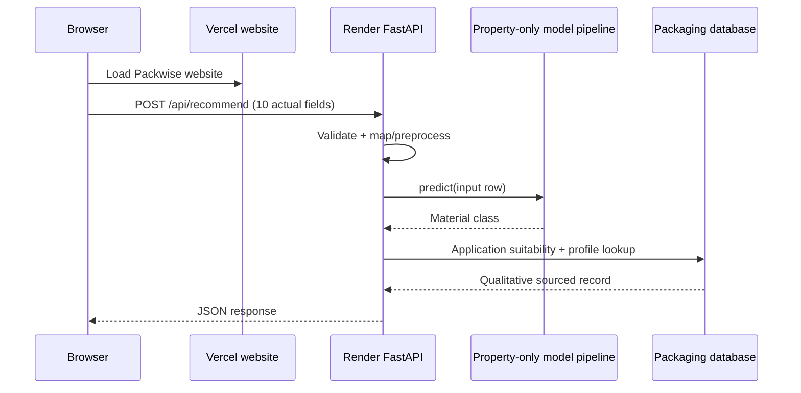

# Packwise architecture and inspection notes

## Existing project inspected

The existing repository at `D:\Packwise Project` contains the Vite website, FastAPI service, model-training scripts and saved artifacts, processed dataset, packaging catalog, tests, and Vercel/Render configuration. The browser keeps the Packwise interface and posts form data to the existing backend. Model inference is performed by the saved scikit-learn pipeline; the API performs commodity validation and post-prediction catalog checks.

## Runtime data flow

1. The website presents seven research-curated commodity profiles, including mature-green bananas, plus a custom-food option and editable numeric/select inputs. The API checks custom names against a bundled FoodOn food-product reference.
2. The browser serializes ten fields as JSON and sends `POST /api/recommend` to `VITE_API_URL`.
3. FastAPI validates the commodity name, numeric ranges, categorical values, composition sums and storage/temperature combinations. Unrecognized names return HTTP 422 before inference.
4. The backend maps request names to the dataset schema and passes eight measured/storage fields to the saved scikit-learn pipeline. Commodity name and pH are validated/echoed but excluded from model inputs.
5. The trained classifier predicts the material-class target. The API does not call the training label rules.
6. A separate suitability check evaluates whether that class lists the selected commodity in the qualitative packaging database.
7. The backend attaches qualitative sourced properties, model-wide feature importance, model-ranked alternatives, warnings, and an evidence-based explanation. Unsupported numeric specification values remain null.
8. The browser displays the actual API response and sends errors through its validation/error state.

## Deployment topology

## Error and readiness behavior

- Missing fields, bad types/ranges, unknown enumerations, invalid commodity names, impossible moisture+fat sums and storage/temperature mismatches return HTTP 422 JSON. A valid unseen name is accepted and sent through the same pipeline as a known food; the response marks it `valid_unseen_commodity` and requests expert review because no commodity-specific application mapping exists.
- Missing model, preprocessing/model load failure, metadata or packaging database returns HTTP 503 and `/api/health` reports not ready.
- Inference exceptions return a structured HTTP 500 response; server details stay in server logs.
- CORS uses local Vite origins by default and explicit `PACKWISE_ALLOWED_ORIGINS` for production.
- No API key or secret is required in the browser.
