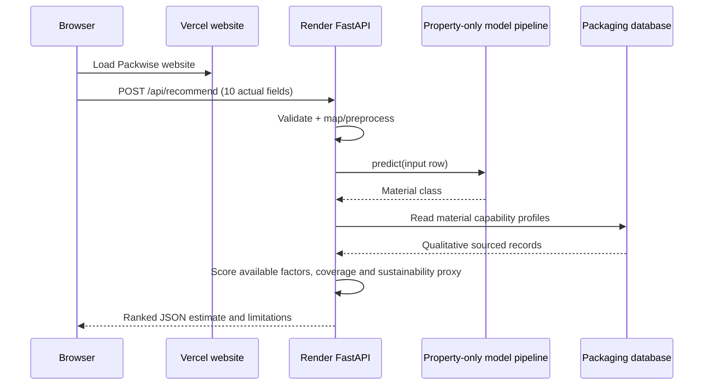

# Packwise architecture and inspection notes

## Existing project inspected

The existing repository at `D:\Packwise Project` contains the Vite website, FastAPI service, model-training scripts and saved artifacts, processed dataset, packaging catalog, tests, and Vercel/Render configuration. The browser keeps the Packwise interface and posts form data to the existing backend. The saved scikit-learn pipeline returns an optional class prediction and probability. The API validates the commodity, builds property-based food requirements, scores every catalog material from qualitative capability bands, and returns a ranked recommendation with separate suitability coverage and sustainability proxy.

## Runtime data flow

1. The website presents seven research-curated commodity profiles, including mature-green bananas, plus a custom-food option and editable numeric/select inputs. The API checks custom names against a bundled FoodOn food-product reference.
2. The browser serializes ten fields as JSON and sends `POST /api/recommend` to `VITE_API_URL`.
3. FastAPI validates the commodity name, numeric ranges, categorical values, composition sums and storage/temperature combinations. Unrecognized names return HTTP 422 before inference.
4. The backend maps request names to the dataset schema and passes eight measured/storage fields to the saved scikit-learn pipeline. Commodity name and pH are validated/echoed but excluded from model inputs.
5. The trained classifier predicts the material-class target. The API does not call the training label rules.
6. The compatibility engine builds relevant food requirements from available moisture, fat, pH, respiration, shelf-life, storage, temperature, humidity and transport inputs. Missing factors are omitted from the weighted score and reduce data coverage.
7. Every catalog material is scored from ordinal capability bands and any model class probability, then ranked. The response includes estimated suitability, dynamic reasons, sustainability proxy, source-linked profile details, alternatives and limitations.
8. The browser displays the actual API response and sends errors through its validation/error state.

## Deployment topology

## Estimates, errors and readiness

- Missing fields with invalid types/ranges, unknown enumerations, invalid commodity names, impossible moisture+fat sums and storage/temperature mismatches return HTTP 422 JSON. Valid unseen food names are accepted when recognized by the bundled food vocabulary or food-term validation; the response marks them `valid_unseen_commodity`. The commodity name and pH are not model features.
- The classifier returns an optional material-class prediction and raw class probability. The compatibility engine separately ranks material profiles from available food/storage inputs and ordinal catalog capability bands. Missing factors are omitted from the weighted suitability calculation and represented in the separate data-coverage value. These values are estimates, not measured package outcomes.
- A model load or inference failure does not stop a recommendation: the API uses the property-compatibility ranking when the material catalog is available. `/api/health` reports HTTP 503 when the model is unavailable, so operational readiness still shows the model issue.
- The sustainability value is a limited weighted index using known material-group count, a documented recycling note and compatibility fit. It is not a life-cycle assessment; the current calculation has no package-mass, regional end-of-life, reuse or measured food-loss inputs.
- Missing or invalid packaging catalog, research registry or food-name reference data prevents recommendations and returns HTTP 503. Unexpected errors in the compatibility calculation return a generic HTTP 500 response; internal details stay in server logs.
- CORS uses local Vite origins by default and explicit `PACKWISE_ALLOWED_ORIGINS` for production.
- No API key or secret is required in the browser.
