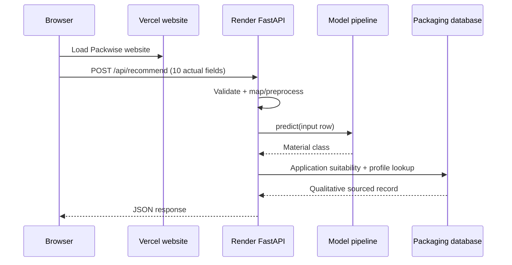

# Packwise architecture and inspection notes

## Existing prototype inspected

The source at `D:\SIH 2026\packwise` was a well-designed browser-only ES module application with a single Node static-file server. The interface included overview, analysis, recommendation, materials library and methodology screens. `src/engine.js` applied deterministic eligibility filters and weighted ratings in the browser; `src/data/materials.js` called its barrier values illustrative. There was no Python backend, trained model, API or deployment configuration. The original source folder was left untouched; its UI, styles, icons and scenarios were copied into `D:\Packwise Project\frontend` before changes.

## Runtime data flow

1. The website presents six supported commodity profiles plus an explicit custom-food option and editable numeric/select inputs. Custom foods are labeled out-of-training-scope.
2. The browser serializes ten fields as JSON and sends `POST /api/recommend` to `VITE_API_URL`.
3. FastAPI validates ranges, categorical values, composition sums, supported commodities and storage/temperature combinations.
4. The backend maps request names to the dataset schema and passes the row to the saved scikit-learn pipeline. Nine fields are model features; pH is validated/echoed but excluded because no defensible pH target rule was found.
5. The trained classifier predicts the material-class target. The API does not call the training label rules.
6. A separate suitability check evaluates whether that class lists the selected commodity in the qualitative packaging database.
7. The backend attaches qualitative sourced properties, model-wide feature importance, model-ranked alternatives, warnings, and an evidence-based explanation. Unsupported numeric specification values remain null.
8. The browser displays the actual API response and sends errors through its validation/error state.

## Deployment topology

## Error and readiness behavior

- Missing fields, bad types/ranges, unknown enumerations, unprefixed unsupported commodities, impossible moisture+fat sums and storage/temperature mismatches return HTTP 422 JSON. An explicit `custom:<name>` request is run through the model but marked out-of-training-scope; no recommendation suitability or confidence is claimed.
- Missing model, preprocessing/model load failure, metadata or packaging database returns HTTP 503 and `/api/health` reports not ready.
- Inference exceptions return a structured HTTP 500 response; server details stay in server logs.
- CORS uses local Vite origins by default and explicit `PACKWISE_ALLOWED_ORIGINS` for production.
- No API key or secret is required in the browser.
